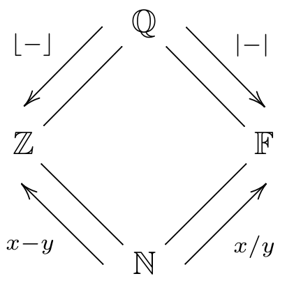

Subtypes
========

In some cases, Disco is willing to accept one type in place of
another, when this is known to be safe.  For example, suppose we have
the following definitions:

::

   f : N -> N
   f(n) = sqrt(n) + 1

   g : Z -> Z
   g(n) = n - 5

   x : N
   x = 16

   y : Z
   y = -10

Of course we can give ``x`` as an input to ``f``, because the type of ``f`` says
it takes natural numbers as input, and ``x`` is a natural number.
Likewise, the type of ``y`` matches ``g``'s input type, so we can give
``y`` as an input to ``g``:

::

   Disco> f(x)
   5
   Disco> g(y)
   -15

On the other hand, we cannot give ``y`` as an input to ``f``.  ``f``
is expecting only natural numbers as input, and it might not be safe
to give it a negative number.  In fact, in this case, it's definitely
not safe: we cannot take the square root of a negative number.

::

   Disco> f(y)
   Error: typechecking failed.
   https://disco-lang.readthedocs.io/en/latest/reference/typecheck-fail.html

However, we *can* give ``x`` as an input to ``g``:

::

   Disco> g(x)
   11

Why is that?  Well, mathematically speaking, every natural number is
also an integer, so if a function is prepared to receive any integer
(positive or negative) as input, then giving it only natural numbers
(*i.e.* nonnegative integers) is perfectly safe.  Intuitively, disco
automatically "converts" the natural number into an integer before
giving it to ``g``.

Since it is always safe to use a natural number anywhere an integer is
expected, we say that ``N`` is a *subtype* of ``Z``.

The four basic :doc:`numeric types <numeric>` can be arranged in a
diamond shape, like so:

Each type is a subtype of the type or types above it.  That is, ``Z``
is a subtype of ``Q``, ``F`` is a subtype of ``Q``, and ``N`` is a
subtype of all the others.

Subtyping for algebraic types
=============================

In addition to the subtype relationships between the basic numeric
types, more complex algebraic types can be subtypes of each other too.

- For :doc:`product types <product-type>`, ``A * B`` is a subtype of
  ``C * D`` exactly when ``A`` is a subtype of ``C``, and ``B`` is a
  subtype of ``D``.  For example, given these definitions:

    ::

       g : Z * Q -> Q
       g(x,y) = y / (3x)

       p : N * N
       p = (2,5)

    It is allowed to give ``p`` as an input to ``g``:

    ::

       Disco> p(g)
       5/6

    Since ``N`` is a subtype of ``Z``, and ``N`` is a subtype of
    ``Q``, therefore ``N * N`` is a subtype of ``Z * Q``.

- Similarly, for :doc:`sum types <sum-type>`, ``A + B`` is a subtype of
  ``C + D`` exactly when ``A`` is a subtype of ``C``, and ``B`` is a
  subtype of ``D``.  For example, given these definitions:

    ::

       g : Z + Q -> Q
       g(left(z)) = z / 2
       g(right(y)) = 3y

       p : N + Z
       p = left(1)

       r : N + Z
       r = right(-2)

    It is allowed to give ``p`` and ``r`` as inputs to ``g``:

    ::

       Disco> g(p)
       1/2
       Disco> g(r)
       -6

    Since ``N`` is a subtype of ``Z``, and ``N`` is a subtype of
    ``Q``, therefore ``N + N`` is a subtype of ``Z + Q``.

- Function types work a little differently.  ``A -> B`` is a subtype
  of ``C -> D`` exactly when **``C`` is a subtype of ``A``** and ``B``
  is a subtype of ``D``.  Notice how the relationship is reversed for
  the input types.  Working out why this makes sense is left as an
  interesting exercise for the reader.
